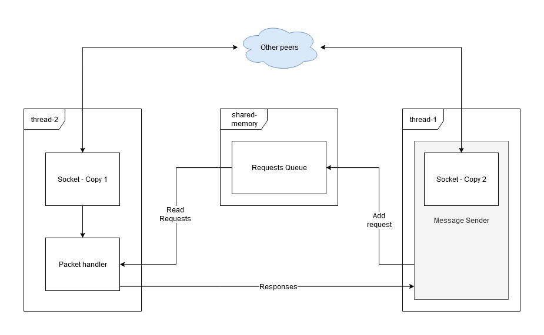

# What is this?
The intention of this piece of code is to create a p2p protocol on top of UDP. 

# Warning
This project is still in a very early stage. It cannot be used for anything yet.

# Contribute
If you want to contribute to this project, either take a look at the issues or send me an email (solanav at qq.com) if you want to collaborate more deeply.

# Goals
1. End to end encryption
2. Decentralized bootstraping
3. Trust system

# Resources I'm using
- [x] [Original Kademlia paper (PDF)](https://pdos.csail.mit.edu/~petar/papers/maymounkov-kademlia-lncs.pdf)
- [x] [A lightweight Approach for Improving the Lookup performance in Kademlia-type Systems](https://arxiv.org/pdf/1408.3079.pdf)
- [ ] [Overbot (PDF)](https://seclab.ccs.neu.edu/static/publications/securecomm2008overbot.pdf)
- [ ] [Enhancing the Kademlia P2P Network (PDF)](https://www.researchgate.net/publication/274547077_Enhancing_the_Kademlia_P2P_Network/link/570fa3b808ae38897ba2c903/download)

# Current architecture

